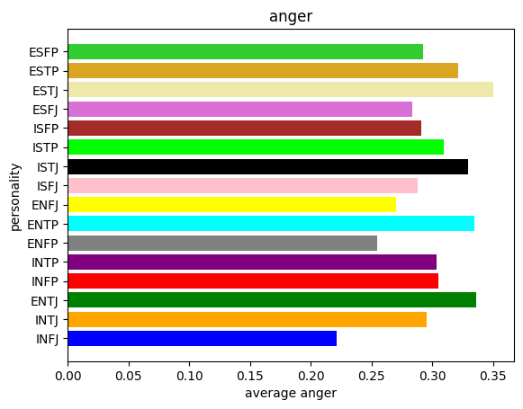
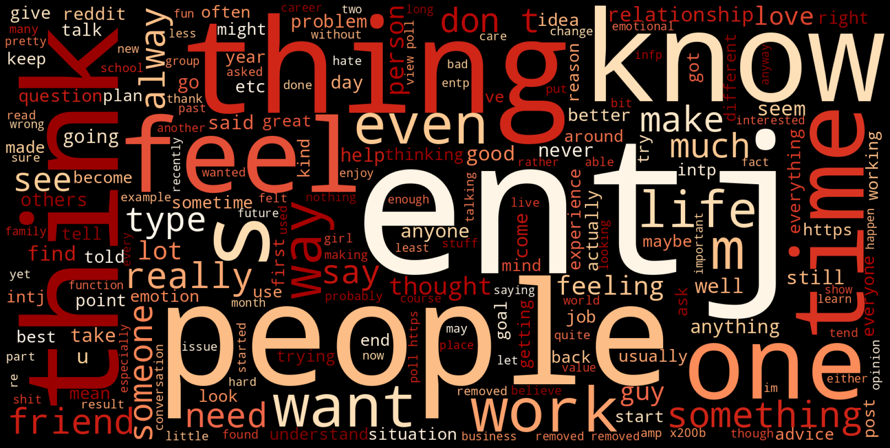
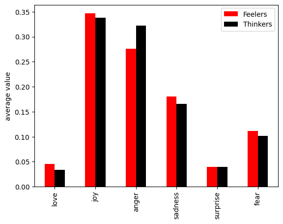
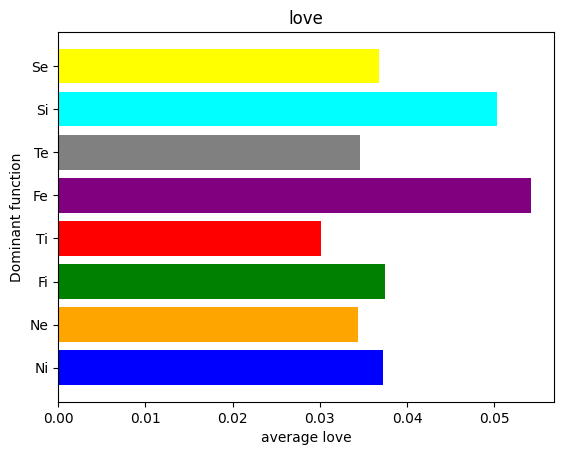
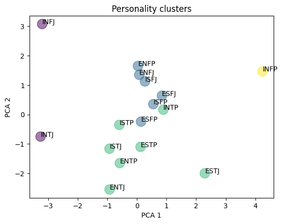

# __MBTI Sentiment Analysis__

This repository contains a Sentiment Analysis over different [Myers-Briggs Personality](https://en.wikipedia.org/wiki/Myers%E2%80%93Briggs_Type_Indicator) subreddits.

## __Data__

For each personality, data were scraped from the posts of the corresponding subreddit (e.g. [r/infj](https://www.reddit.com/r/infj/) for the INFJ personality type), using [this script](https://github.com/aleceress/mbti_sentiment/blob/master/subreddit_posts_scraper.py). 

## __Models__
The following models were applied.

- [DistilBERT base uncased finetuned SST-2 ](https://huggingface.co/distilbert-base-uncased-finetuned-sst-2-english?text=I+like+you.+I+love+you), to obtain a POSITIVE and NEGATIVE score for each post. 
- [Distilbert-base-uncased-emotion](https://huggingface.co/bhadresh-savani/distilbert-base-uncased-emotion), to get post scores over the following emotions: _love, joy, anger, sadness, surprise_ and _fear_.

## __Analysis__
The notebooks [type_analysis.ipynb](https://github.com/aleceress/mbti_sentiment/blob/master/type_analysis.ipynb) and [aggregate_anaysis.ipynb](https://github.com/aleceress/mbti_sentiment/blob/master/aggregate_analysis.ipynb) contain visualizations of the performed analysis.

### __Type analysis__
[type_analysis.ipynb](https://github.com/aleceress/mbti_sentiment/blob/master/type_analysis.ipynb) shows:
- POSITIVE/NEGATIVE percentage and average emotion associated with each personality subreddit, along with their comparison.
- A frequency wordcloud for each subreddit.



<p align="center">
  
</p>


### __Aggregate analysis__

[aggregate_analysis.ipynb](https://github.com/aleceress/mbti_sentiment/blob/master/aggregate_analysis.ipynb) includes:

-  A study on whether there's a dependence between Myers-Briggs traits (**E**xtraversion/**I**ntroversion, **S**ensing/I**n**tuition, **T**hinking/ **F**eeling and **J**udging/**P**erceiving) and the sentiment/emotion scores of subreddit posts. This investigation was performed computing  [Chi-Squared](https://en.wikipedia.org/wiki/Chi-squared_test) and [Odds Ratio](https://it.wikipedia.org/wiki/Odds_ratio) and conveyed by visualizations.
-  Visualizations of the previous quest, but considering Dominant Cognitive Fuctions.
-  A clustering of personalities based on POSITIVE/NEGATIVE percentage and average emotions of their subreddit posts.
  







## __Running__ 


To run all the code in the respository, you can create a virtual environment and run the following commands.

```
virtualenv venv 
source ./venv/bin/activate
pip install -r requirements.txt
```

To execute [subreddit_post_scraper.py](https://github.com/aleceress/mbti_sentiment/blob/master/subreddit_posts_scraper.py), you first need an instance of a MySQL database to connect to.
You also need some parameters associated to your reddit account and to the MySQL database: all needs to be inserted in a `config.py` file, following the schema of [`config.example.py`](https://github.com/aleceress/mbti_sentiment/blob/master/config.example.py).